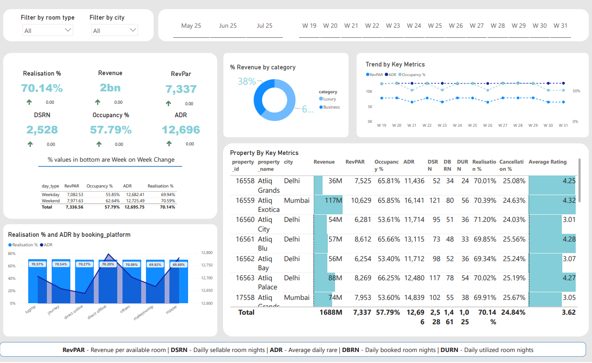
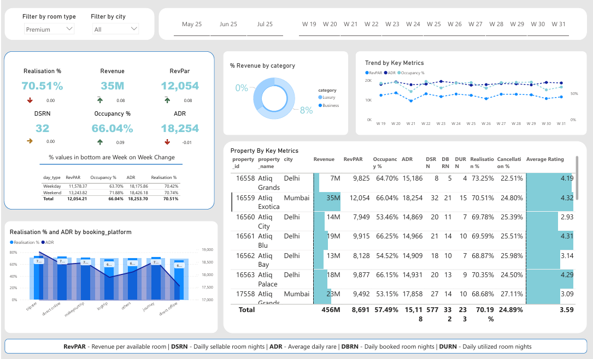
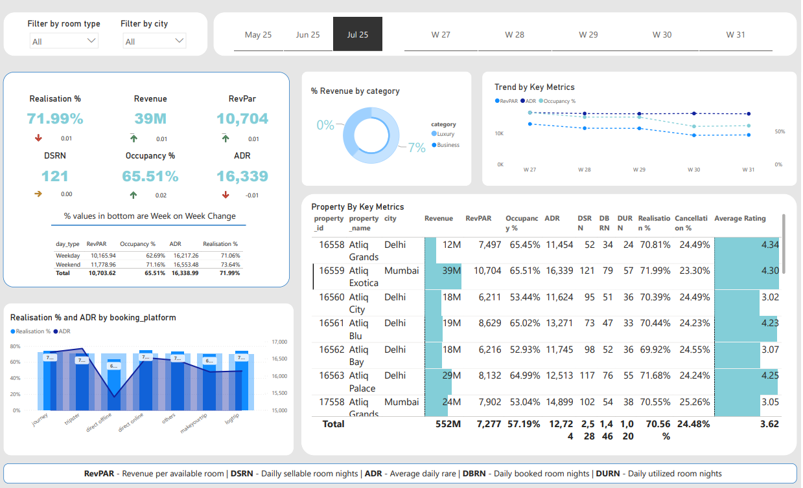

# Hotel Booking Analysis to Optimize Revenue and Reduce Cancellations

## Overview
This project analyzes hotel booking and performance data across multiple properties to identify patterns affecting revenue, occupancy, and cancellations.  
The goal is to provide actionable insights that help hotel managers make data-driven decisions on pricing, channel strategy, and capacity planning.

---

## Problem
Hotel management teams often struggle with:
- High cancellation rates that erode revenue stability
- Uneven occupancy across properties and time periods
- Underperforming distribution channels
- Lack of clarity on which segments generate the most value

This analysis identifies the key factors behind these issues and surfaces where action will have the most impact.

---

## Data
- Booking and revenue data across 7 hotel properties (May–July 2025)
- Weekly granularity (W19–W31)
- Breakdown by city (Delhi / Mumbai), room type, and booking platform
- Key metrics: RevPAR, ADR, Occupancy %, Cancellation %, Realisation %, DSRN, DBRN, DURN

---

## Dashboard Overview

### 📊 Full Period Overview — All Properties (May–Jul 2025)

Across all properties over the full period, total revenue reaches **2bn**, with an overall RevPAR of **7,337** and occupancy at **57.79%**. The revenue mix is split ~38% Luxury / ~62% Business. The trend chart shows relatively stable RevPAR and ADR week over week, while occupancy remains below 60% — indicating room for improvement through smarter pricing or channel optimization. Realisation % of **70.14%** points to consistent but not optimal booking conversion.

---

### 📅 Monthly View — July 2025

July shows a revenue of **39M** for the flagship Mumbai property (Atliq Exotica), with RevPAR at **10,704** and occupancy at **65.51%** — the strongest occupancy across the period. The downward trend in the Key Metrics chart across weeks W27–W31 suggests demand softening toward the end of July, which could be addressed with targeted promotions or flexible pricing strategies.

---

### 🏨 Premium Room Type Filter — May 2025

Filtering for Premium room type in May highlights a Realisation % of **70.51%** with revenue of **35M** and a cancellation rate of **24.80%** for Atliq Exotica. The booking platform breakdown shows that **direct offline** and **tripster** channels drive strong ADR, while some platforms underperform on Realisation % — suggesting where channel investment should be reallocated.

---

## Key Insights

- **Mumbai properties consistently outperform Delhi** on RevPAR and ADR, despite similar occupancy levels — pointing to stronger pricing power in that market
- **Cancellation rates hover around 24–25%** across most properties, representing a significant revenue risk that could be reduced through stricter booking policies or targeted incentives
- **Weekends generate higher RevPAR** than weekdays across all properties (e.g. 13,243 vs 11,578 in the May Premium segment), confirming demand concentration that can be leveraged for dynamic pricing
- **Certain booking platforms underperform** on Realisation %, indicating low-quality or high-risk traffic that should be deprioritized
- **Occupancy below 60% for most properties** suggests supply is not fully utilized — especially during weekday troughs — where targeted promotions could drive incremental revenue
- **Atliq City (Delhi) lags significantly** on RevPAR (6,211–7,949) compared to Atliq Exotica (10,629–12,054), warranting a review of its pricing strategy and customer segment mix

---

## Business Value

This analysis enables hotel management to:
- **Reduce revenue leakage** by identifying high-cancellation segments and adjusting policies
- **Optimize pricing strategy** based on weekday/weekend demand patterns
- **Reallocate channel spend** toward platforms with higher Realisation %
- **Benchmark properties** against each other to identify underperformers and best practices
- **Plan capacity and staffing** more effectively using weekly occupancy trends

---

## Tools Used
- Power BI (Dashboard & Visualization)
- DAX (KPI calculations and WoW comparisons)
- Data Modeling across multiple property datasets
- Time Intelligence & Comparative Analysis

---

## Metric Glossary

| Metric | Description |
|--------|-------------|
| **RevPAR** | Revenue per available room |
| **ADR** | Average daily rate |
| **DSRN** | Daily sellable room nights |
| **DBRN** | Daily booked room nights |
| **DURN** | Daily utilized room nights |
| **Realisation %** | Share of booked revenue actually collected |

---

## Conclusion

This project goes beyond standard reporting to surface the business decisions behind the numbers. By combining property-level benchmarking, channel analysis, and weekly trend tracking, the dashboard gives hotel managers a clear view of where revenue is being left on the table — and what to do about it.
